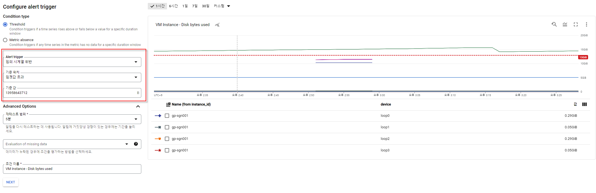

# GCP Monitoring


### 모니터링 설정

1. #### 모니터링 서버 확인

- 모니터링 -> VM 인스턴스


- 에이전트가 설치 되어있지 않으면 상담원에 감지되지 않음으로 설정

##### 2. 에이전트설치

- 서버 선택 후 에이전트 설치 -> Cloud Shell 실행 #단 설치시 22 port any대역 open필요


##### Monitoring agent 설치

```shell
curl -sSO https://dl.google.com/cloudagents/add-monitoring-agent-repo.sh && \
sudo bash add-monitoring-agent-repo.sh && \
sudo apt-get update

sudo apt-get install -y 'stackdriver-agent=6.*'
sudo service stackdriver-agent status
```


##### 3. 알림 채널 설정

- 모니터링 -> 알림 -> 알림 채널 설정


제공 항목 : Mobile Device, PagerDuty Services, PagerDuty Sync, Slack, Email, SMS 등


##### 4. 정책 설정(disk 사용율 체크)

##### metric 설정

- VM INSTANCE - DISK BYTES USED

##### 필터 추가

- state = used


##### 트리거 구성

- Condition type 

```
Thershold : 해당 기간 트리거에 위배될때
Metric absence : 해당 기간 데이터가 없을 시
```

- 트리거

기준 위치 : 임곗값 초과 (기준 값 초과시) 

기준 값 : Byte 기준





##### 알림 설정

- 알림 채널시 추가한 알림 설정


5. ##### 알람 확인

   


