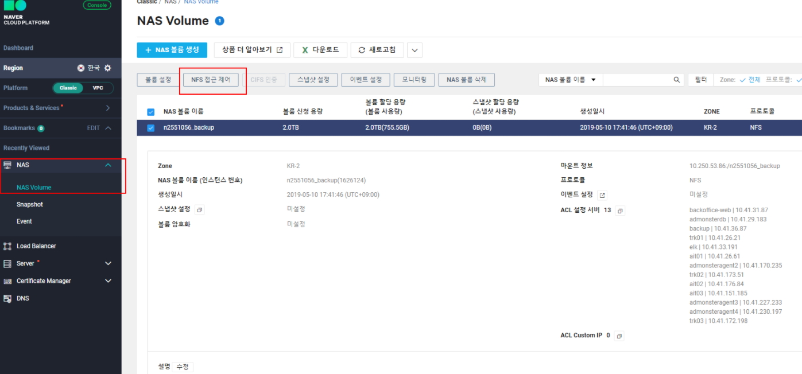
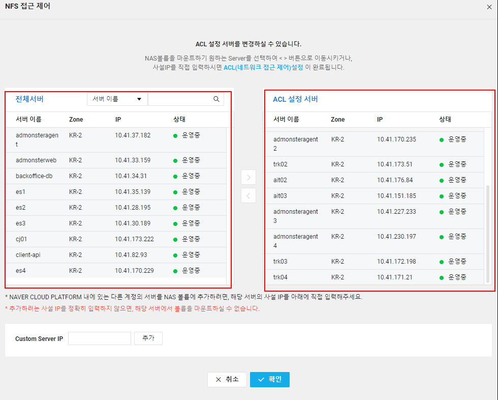
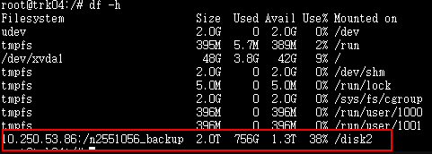
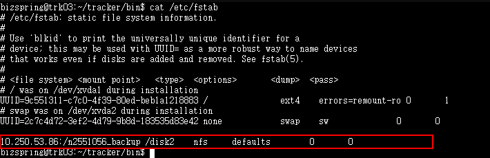

# NCP NAS 추가

### Linux NFS로 마운트하기

## ubuntu 16.04 일 경우 사용

### step 0. NAS 접근 제어 설정

- NFS 접근 제어 선택

  

- NAS 접근 서버 설정
- NAS 사용할 서버를 ACL 설정으로 위치 변경



### step 1. NFS 패키지 설치

```bash
# 서비스 설치
sudo apt-get install nfs-common
```

### step 2. 데몬 기동 및 서비스 등록

```bash
# 서비스 기동 및 서비스 등록
sudo systemctl enable rpcbind.service
sudo systemctl start rpcbind.service
```

### step 3. 마운트하기

```bash
# 마운트할 디렉터리 생성
sudo mkdir /disk2
sudo mount -t nfs 볼륨 마운트 포인트

## 예시
## test 진행시 따라해주세요 서브계정에 권한이 없어서 nas 볼륨 이름 확인이 불가합니다.
sudo mount -t nfs 10.250.53.86:/n2551056_backup /disk2
```



### step 4. 부팅 시 자동으로 마운트하기

```bash
# fstab 등록
sudo vi /etc/fstab에 mount 정보 등록

# 예를 들어, 10.10.10.10:/vol/nas_volume 라는 볼륨을 받았고 
# 이를 /mnt/nas에 마운트하려 한다면 다음과 같이 fstab에 내용을 추가하면 됩니다
10.10.10.10:/vol/nas /mnt/nas nfs defaults 0 0

# 예시
# test 진행시
10.250.53.86:/n2551056_backup /disk2 nfs defaults 0 0
```

