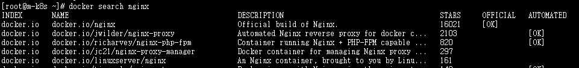
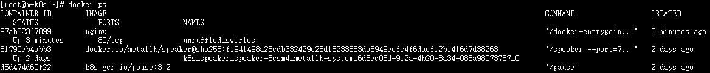

# docker


##### 이미지 검색하기

```shell
docker search <검색어>

INDEX : 이미지가 저장된 레지스트리의 이름
NAME : 검색된 이미지 이름
DESCRIPTION : 이미지 설명
STARS : 해당 이미지를 내려받은 사용자에게 받은 평가 횟수
OFFICIAL : [OK] 표시는 해당이미지에 포함된 애플리케시연, 미들웨어 등을 개발한 업체에서 공식적으로 제공한 이미지
AUTOMATED : [OK] 표시는 도커 허브에서 자체적으로 제공하는 이미지 빌드 자동화 기능을 활용해 생성한 이미지
```




##### 컨테이너 실행하기

```shell
docker run -d --restart always nginx

-d(--detach) : 컨테이너를 백그라운드에서 구동. 옵션을 생략하면 컨테이너 내부에서 실행되는 애플리케이션의 상태가 화면에 계속 표시

--restart : 컨테이너의 재시작과 관련된 정책을 의미하는 옵션 
- 도커가 예상치 못한 오류로 인해 시스템에서 중지될 경우 컨테이너를 즉시 재시작하거나 자동으로 시작하도록 설정
```


| 값             | 컨테이너 비정상 종료 시    | 도커 서비스 시작 시                           |
| -------------- | -------------------------- | --------------------------------------------- |
| no(기본값)     | 컨테이너를 재시작하지 않음 | 컨테이너를 시작하지 않음                      |
| on-failure     | 컨테이너를 재시작함        | 컨테이너를 시작함                             |
| always         | 컨테이너를 재시작함        | 컨테이너를 시작함                             |
| unless-stopped | 컨테이너를 재시작함        | 사옹자가 직접 정지하지 않은 컨테이너만 시작함 |


##### 컨테이너 상태 확인

```shell
docker ps

docker ps -f(--filter) <필터링 대상>

CONTAINER ID : 컨테이너를 식별하기 위한 고유 ID
IMAGE : 컨테이너를 만드는 이미지
COMMAND : 컨테이너가 생성될 때 내부에서 작동할 프로그램을 실행하는 명령어
CREATED : 컨테이너가 생성된 시간
STATUS : 컨테이너가 작동을 시작한 시각
PORTS : 컨테이너가 사용하는 포트 및 프로토콜
NAMES : 컨테이너의 이름
```





##### 컨테이너 경로 설정

```
docker run -d -p 8080:80 --name nginx-exposed --restat always nginx

-p(--publish) 외부에서 호스트로 보낸 요청을 컨테이너로 전달하는 옵션
-p <요청 받을 호스트 포트>:<연결할 컨테이너 포트>
```


##### 컨테이너 내부 파일 변경하기

```
docker cp
 - docker cp <호스트 경로> <컨테이너 이름>:<컨테이너 내부 경로> 형식으로 호스트에 위치한 파일을 구동 중인 컨테이너 내부에 복사합니다. 따라서 컨테이너에 임시로 필요한 파일이 있는 경우 단편적으로 전송하기 위해 사용
 
Dockerfile ADD
- Dockerfile에 ADD라는 구문으로 컨테이너 내부로 복사할 파일을 지정하면 이미지를 빌드할 때 지정한 파일이 이미지 내부로 복사

바인드 마운트
- 호스트의 파일 시스템과 컨테이너 내부를 연결해 어느 한쪽으로 작업한 내용이 양쪽에 동시에 반영되는 방법

볼륨
- 호스트의 파일 시스템과 컨테이너 내부를 연결하는 것은 바인드 마운트와 동일하지만, 호스트의 특정 디렉터리가 아닌 도커가 관리하는 볼륨을 컨테이너와 연결
```


| 구분           | docker cp     | Dockerfile ADD               | 바인드 마운트         | 볼륨                     |
| -------------- | ------------- | ---------------------------- | --------------------- | ------------------------ |
| 컨테이너 적용  | 구동 중 복사  | 이미지 생성 시 복사          | 구동 시 디렉터리 연결 | 구동 시 도커의 볼륨 연결 |
| 파일 보관 위치 | 컨테이너 내부 | 컨테이너 내부                | 호스트(디렉터리)      | 호스트(도커 볼륨)        |
| 주 활용 용도   | 임시 파일     | 컨테이너 생성 시 필요한 파일 | 보존이 필요한 파일    | 보존이 필요한 파일       |
| 관리 편의성    | 좋지 못함     | 좋음                         | 좋음                  | 좋음                     |
| 파일 보존성    | 좋지 못함     | 좋음                         | 매우 좋음             | 좋음                     |


##### 바운드 마운트로 컨테이너 연결하기

```shell
1. 디렉터리 생성
mkdir -p /root/html

2. 컨테이너 구동
docker run -d -p 8080:80 \
-v /root/html:/usr/share/nginx/html --restart always --name nginx-bind-mount nginx

3. 컨테이너 조회 STAUS 확인
docker ps -f name=nginx-bind-mounts
CONTAINER ID        IMAGE               COMMAND                  CREATED             STATUS              PORTS                  NAMES
030d006c417f        nginx               "/docker-entrypoin..."   4 minutes ago       Up 4 minutes        0.0.0.0:8081->80/tcp   nginx-bind-mounts

4. 페이지 생성
/root/html 에 index.html 생ㅅ어

5 접속 확인
192.168.1.10:8081 (서버 ip)

## 컨테이너 내부 확인
docker exec <컨테이너 ID> <명령어>
[root@m-k8s ~]# docker exec 030 ls /usr/share/nginx/html    
index.html
```


##### 볼륨으로 호스트와 컨테이너 연결하기

```shell
1. 볼륨 생성
docker volume create <nginx-volume : 볼륨 이름>

2. 생성된 볼륨 조회
docker volume inspect nginx-volume
[root@m-k8s ~]# docker volume inspect nginx-volume
[
    {
        "Driver": "local",
        "Labels": {},
        "Mountpoint": "/var/lib/docker/volumes/nginx-volume/_data",
        "Name": "nginx-volume",
        "Options": {},
        "Scope": "local"
    }
]

3. 볼륨으로 생성된 디렉터리 확인
ls /var/lib/docker/volumes/nginx-volume/_data

4. 호스트와 컨테이너의 디렉터리 연결할 컨테이너 구동
docker run -d -v nginx-volume:/usr/share/nginx/html -p 8082:80 --restart always --name nginx-volume nginx
-v [볼륨 이름]:[컨테이너 디렉터리]
```


##### 컨네이너 정리하기

```shell
1. 컨테이너 조회
docker ps -f ancesotr=nginx (nginx 이미지를 기반으로 생성된 컨테이너 조회)

2. 컨테이너 정지 - docker stop <컨테이너 이름 | ID>
ex) docker stop tender_snyder

3. 컨테이너 한번에 정리 - 해당 사용 이미지만
[root@m-k8s ~]# docker stop $(docker ps -q -f ancestor=nginx)
```


##### 컨테이너 및 이미지 삭제

```
docker rm <컨테이너 이름 | ID> 
```


### 컨테이너 이미지 만들기

##### 기본 방법으로 빌드

| 파일명     | 설명                                                         |
| ---------- | ------------------------------------------------------------ |
| Dockerfile | 컨테이너 이미지를 빌드하기 위한 정보                         |
| mvnw       | 메이븐 래퍼라는 이름의 리눅스 프로그램, 메이븐 실행을 위한 환경 설정을 자동화 |
| pom.xml    | 메이븐 래퍼가 작동할 때 필요한 절차와 빌드 정보를 담고 있습니다. |
| src        | 메이븐으로 빌드할 자바 소스 디렉터리                         |


```
컨테이너 빌드 과정
- 자바 소스 빌드-> 도커파일 작성 -> 도커파일 빌드 -> 빌드 완료
```


