# git branch 사용


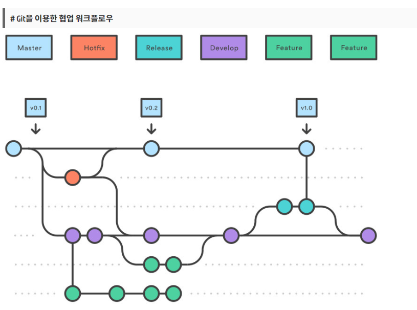

- Master - 운영 관리 브랜치
- Develop - 개발 관리 브랜치. 기능 개발에 집중된 작업 개념의 브랜치로 볼 수 있다.
- hotfixes - 운영 중에 치명적인 버그가 발생되었을 때, 해당 브랜치를 생성하여 cherry pick과 같은 기능을 사용하여 merge 및 관리를 하는 브랜치
- release - 새로운 출시 버전을 관리하는 브랜치. 출시된 기존 버전 외에 해당 브랜치에서 작업을 하다 master로 병합 될 수 있다
- feature - 기능 개발을 위한 브랜치. 주로 새로운 작업을 위한 브랜치로 생성


##### branch 확인

```git
git branch -v
```

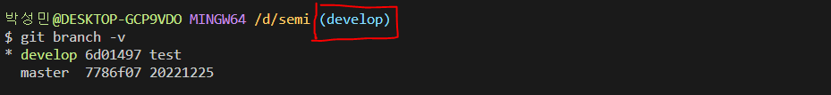

- 체크박스 부분이 현재 사용중인 branch


##### feature 생성

```git
- feature 생성은 한 자리에서 진행시 처음 한번만 시작하면 됨
git flow init

계속 enter 진행 후 feature에서 아래와 같이 작성(!!! 마지막에 / 반드시 붙임)
feature/개인이름/
```


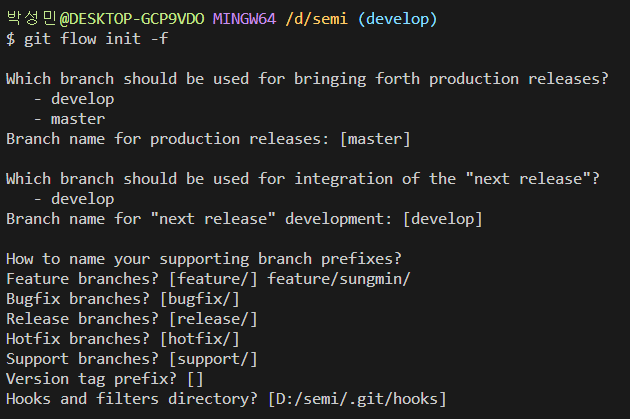


##### feature 시작

```
- 두번 째 작업부턴 바로 start 진행
git flow feature start [branch name]
- 브랜치 이름은 보통 작업 내용으로 작성
```

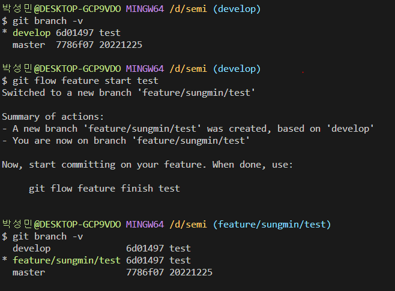


#####  finish & publish 차이점

- finish 하면 작업 내용이 git에 올라가지 않고 로컬 develop 브랜치에 합쳐짐

- pulish 하면 작업 내용이 git에 업로드 and 현재 브랜치가 삭제되지 않음


##### feature 종료 방법 1) finish 사용

```
개인 작업 종료 후
git add 
git commit 까지 동일하게 진행 후
git flow feature finish [branch name] 
- finish로 사용 종료 하면 develop으로 branch가 바뀌며 develop에 commit 된 상태로
repository에 올리려면 push 진행해야함

git push origin develop
```


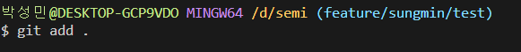


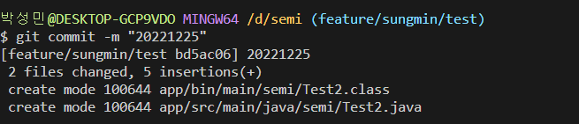


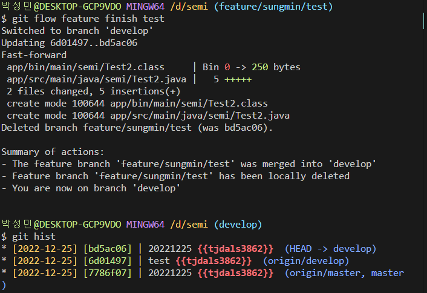


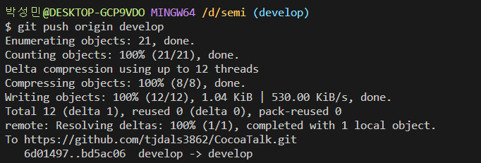


##### feature 종료 방법 1) publish 사용

```
개인 작업 종료 후
git add 
git commit 까지 동일하게 진행 후
git flow feature publish [branch name] 
- publish로 올릴경우 github에 새로 branch가 생성되며
- 상단의 Pull requests를 통해 직접 develop branch로 merge 해야한다
주의 !!!! master가 아닌 develop로 넣어야함 !!!!
```


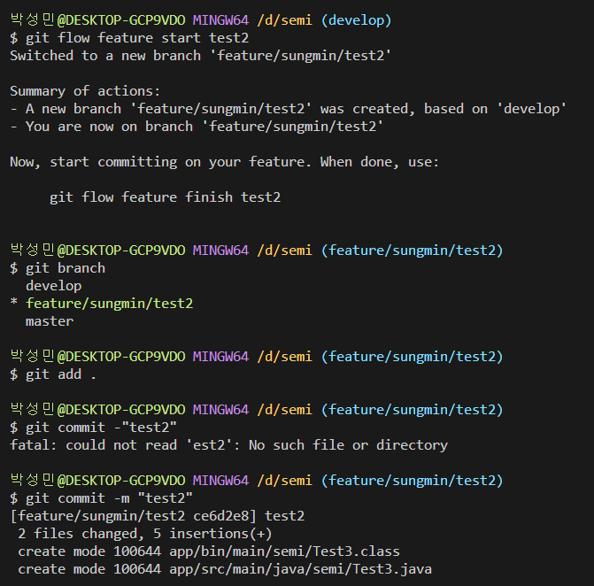


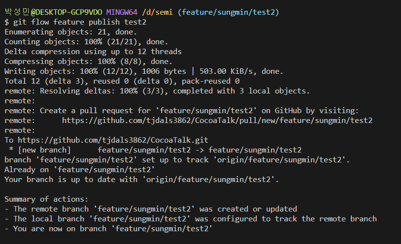


- 생성한 feature branch 확인

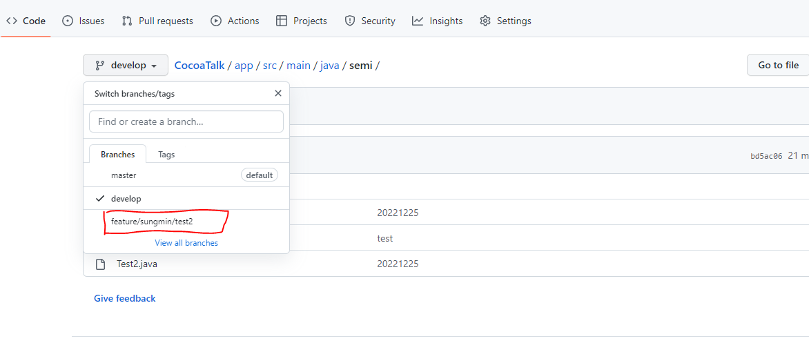

- develop로 merge 진행

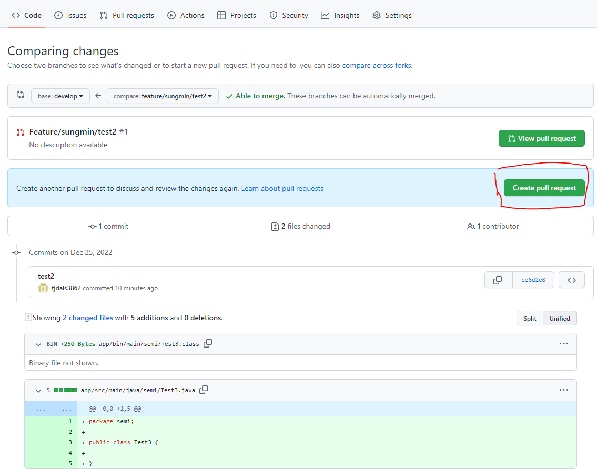


