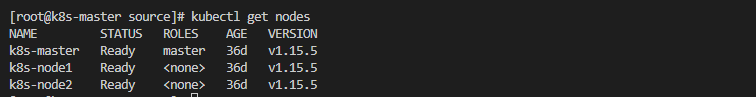
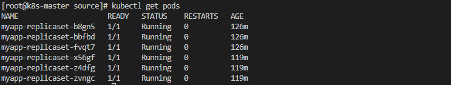
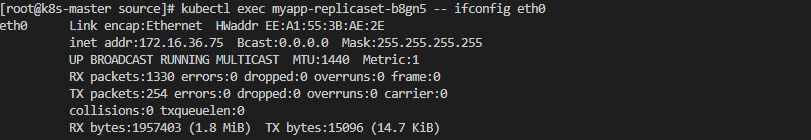
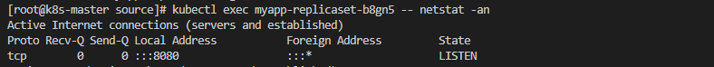
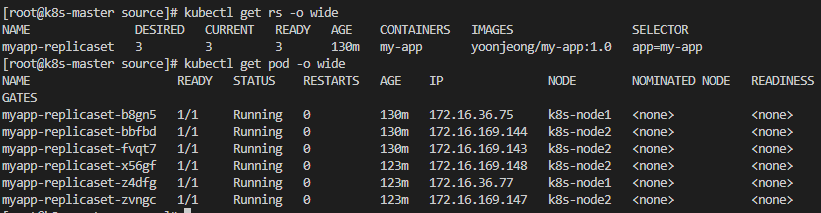
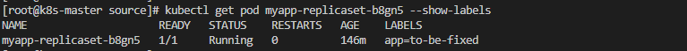
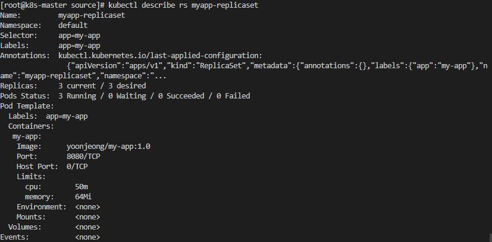
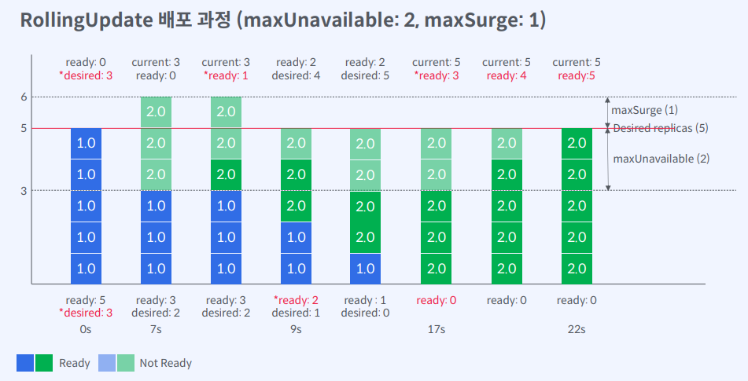
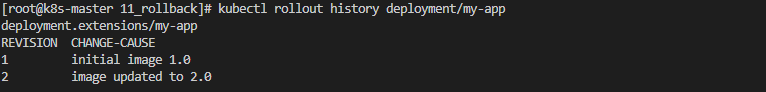
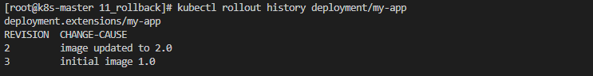

# ReplicaSet

```
레플리카셋(replicaset)은 실행되는 파드(pod) 개수에 대한 가용성을 보증 하며 지정한 파드 개수만큼 항상 실행될 수 있도록 관리 
- 클러스터 관리자 대신 Pod 수가 부족하거나 넘치지 않게 Pod 수를 조정
- Pod/노드 상태에 따라 Pod의 수를 조정할 수 있도록 ReplicaSet에게 역할을 위임
```


```yaml
apiVersion: apps/v1 	# Kubernetes API 버전
kind: ReplicaSet 		# 오브젝트 타입
metadata:				# 오브젝트를 유일하게 식별하기 위한 정보
	name: blue-app-rs 	# 오브젝트 이름
	labels: 			# 오브젝트 집합을 구할 때 사용할 이름표
		app: blue-app
spec: 					# 사용자가 원하는 Pod의 바람직한 상태
	selector: 			# ReplicaSet이 관리해야하는 Pod을 선택하기 위한 label query
	replicas: 			# 실행하고자 하는 Pod 복제본 개수 선언
	template: 			# Pod 실행 정보 - Pod Template과 동일 (metadata, spec, …)

```


- ##### 쿠버네티스 클러스터에서 속한 노드 목록 조회

```shell
kubectl get nodes
```




- ##### 실행 중인 Pod(컨테이너) 목록 조회 

```shell
kubectl get pods
```




- ##### 컨테이너 IP 확인

```shell
kubectl exec <pod-name> -- ifconfig eth0
kubectl exec <pod-name> -- cat /etc/hosts
```




- ##### 컨테이너 리스닝 포트 확인

```shell
kubectl exec <pod-name> -- netstat -an
```




- ##### 로컬 포트 포워딩(8080 -> 8080)

```shell
kubectl port-forward hello-app 8080:8080
```


|                                      |                                                          |
| ------------------------------------ | -------------------------------------------------------- |
| ReplicaSet 생성                      | kubectl apply -f <yaml 파일 경로>                        |
| ReplicaSet과 배포 이미지 확인        | kubectl get rs <replicaset-name> -o wide                 |
| Pod 목록과 배포된 노드 확인          | kubectl get pod -o wide                                  |
| ReplicaSet의 Pod 생성 기록 확인      | kubectl describe rs <replicaset-name>                    |
| ReplicaSet의 Pod 생성 이후 과정 확인 | kubectl get events --sort-by=.metadata.creationTimestamp |
| ReplicaSet 파드로 트래픽 전달        | kubectl port-forward rs/<replicaset-name> 8080:8080      |


- ##### 애플리케이션 배포 개수를 조정 (replicas: 복제본)

```shell
kubectl scale rs/<replicaset-name> --replicas <number of replicas>
```


- ##### ReplicaSet 생성 결과 ‒ Pod 목록 조회

```shell
kubectl get rs -o wide
kubectl get pod -o wide
```




- ##### ReplicaSet의 Pod 삭제

```shell
kubectl delete pod <pod-name>
```


- ##### ReplicaSet만 삭제

```shell
kubectl delete rs <rs-name> --cascade=orphan
```


- ##### Pod와 레이블 확인

```shell
 kubectl get pod <pod-name> --show-labels
```




- ##### Pod 레이블 변경

```
 kubectl label pod <pod-name> <label-key>=<label-value> --overwrite
```


- ##### ReplicaSet 이벤트 확인

```shell
 kubectl describe rs <replicaset-name>
```




- ##### Pod의 Owner 확인

```shell
kubectl get pod <pod-name> -o jsonpath="{.metadata.ownerReferneces[0].name}"
```


- ##### ReplicaSet 이미지 변경

```shell
 kubectl set image rs/<replicaset-name> <container>=<image>
```


# Deployment


##### Deployment는 Pod 배포 자동화를 위한 오브젝트(Replicaset + 배포 전략)

- 새로운 Pod를 롤아웃/롤백할 때 ReplicaSet 생성을 대신해준다(Pod 복제)
- 다양한 배포 전략을 제공하고 이전 파드에서 새로운 파드로의 전환 속도를 제어 할 수 있다.


```yaml
apiVersion: apps/v1 			# Kubernetes API 버전
kind: Deployment 				# 오브젝트 타입
metadata: 						# 오브젝트를 유일하게 식별하기 위한 정보
	name: my-app 				# 오브젝트 이름
spec: 							# 사용자가 원하는 Pod의 바람직한 상태
	selector: 					# ReplicaSet을 통해 관리할 Pod을 선택하기 위한 label query
		matchLabels:
			app: my-app
		replicas: 3 			# 실행하고자 하는 Pod 복제본 개수 선언
		template: 				# Pod 실행 정보 - Pod Template과 동일 (metadata, spec, …)
			metadata:
				labels:
					app: my-app # selector에 정의한 label을 포함해야한다
			spec:
				containers:
				- name: my-app
				  image: my-app:1.0
```


##### Recreate

- 새로운 버전을 배포하기 전에 이전 버전이 즉시 종료됨
- 컨테이너가 정상적으로 시작되기 전까지 서비스 하지 못함
- replicas 수많큼의 컴퓨팅 리소스 필요
- 개발단계에서 유용

​                                                                                           

##### RollingUpdate

- 새로운 버전을 배포하면서 이전 버전을 종료
- 서비스 다운 타임 최소화
- 동시에 실행되는 Pod의 개수가 replicas를 넘게 되므로 컴퓨팅 리소스 더 많이 필요

- maxUnavailable : 롤링 업데이트를 수행하는 동안 유지하고자 하는 최소 Pod의 비율(수)을 지정할 수 있다

- maxSurge : 롤링 업데이트를 수행하는 동안 허용할 수 있는 최대 Pod의 비율(수)을 지정할 수 있다.


##### maxUnavailable

```
- 롤링 업데이트를 수행하는 동안 유지하고자 하는 최소 Pod의 비율(수)을 지정할 수 있다.
- 최소 Pod 유지 비율 = 100 - maxUnavailable 값
```


##### maxSurge

```
- 롤링 업데이트를 수행하는 동안 허용할 수 있는 최대 Pod의 비율(수)을 지정할 수 있다
- 최대 Pod 허용 비율 = maxSurge 값
```


##### maxUnavaiable, maxSurge가 필요한 이유

```
- 기존에 실행 중인 Pod을 일시에 제거하면 새로운 Pod이 생성되기까지 서비스 중단이 발생할 수 있다
- 모든 Old Pod을 New Pod으로 전환하는데 시간을 최소화할 수 있다
- 새로운 Pod을 replicas 수만큼 미리 배포한다면 리소스가 부족할 수 있다 (약 2배 리소스 확보 필요)
- 그래서 maxUnavailable을 이용해서 최소 서비스 운영에 영향을 주지 않을 만큼 유지해야 하는 Pod 
수를 선언할 수 있다
- maxSurge로 어떤 시점에 동시에 존재할 수 있는 최대 Pod 수를 선언하여 배포 속도를 조절함과 동시에
리소스를 제어할 수 있다
- 유지해야할 Pod 수의 상한선과 하한선을 쿠버네티스에게 알리기 위한 옵션이다
```




##### Deployment 배포 진행중/완료 상태 확인

```shell
kubectl rollout status deployment/my-app
```


##### Deployment의 Pod replicas 변경 (spec.replicas)

```shell
kubectl scale deployment/my-app --replicas=5
```


##### Deployment의 ReplicaSet 이벤트 확인

```shell
kubectl describe deployment/my-app
Events:
Reason From Message
ScalingReplicaSet deployment-controller Scaled up replica set my-app-5b7548d6b to 2
ScalingReplicaSet deployment-controller Scaled up replica set my-app-5b7548d6b to 5
```


|                                             |                                                              |
| ------------------------------------------- | ------------------------------------------------------------ |
| Deployment 생성                             | kubectl apply -f <yaml 파일 경로>                            |
| Deployment 이벤트 확인                      | kubectl describe deployment <deployment-name>                |
| Deployment를 통한 생성한 Pod 상태 변화 확인 | kubectl get deployment -w                                    |
| Deployment 배포 진행중/완료 상태 확인       | kubectl rollout status deployment <deployment-name>          |
| Deployment의 Pod replicas 변경              | kubectl sacle deployment <deployment-name> --replicas=<number-of-pod> |
| ReplicaSet 이벤트 확인                      | kubectl describe rs <replicaset-name>                        |
| ReplicaSet이 생성하는 Pod 상태 변화 확인    | kubectl get rs -w                                            |
| 레이블 셀렉터로 리소스 삭제                 | kubectl delete all -l <label-key>=<label-value>              |


### Deployment Rollback

##### Revision 조회

```shell
kubectl rollout history
kubectl rollout history deployment/my-app --revision=2
```





##### Revision으로 롤백

```shell
$ kubectl rollout undo deployment/<deployment-name>
$ kubectl rollout undo deployment/<deployment-name> --to-revision=1
```





##### 배포 변경 사유 기록

```shell
$ kubectl annotate deployment/<deployment-name> \
kubernetes.io/change-cause=“some cause"
```


