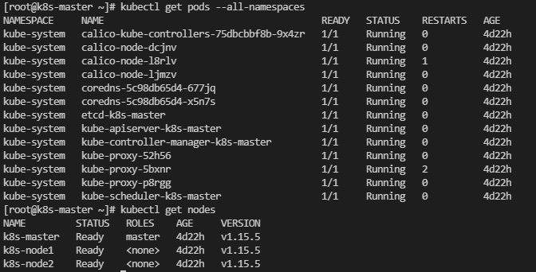

## Kubernetest 설치

- 환경 설정 : 메인 노드 1개, 워커 노드 2대 진행(os : CentOS 7)
- 172.16.208.18   k8s-master
  172.16.208.21   k8s-node1
  172.16.208.22   k8s-node2


### 환경 설정

##### Selinux 설정

```shell
vi /etc/sysconfig/selinux

## 변경 전
SELINUX=disabled

## 변경 후
SELINUX=permissive
```


##### 방화벽 해제

- firewalld 비활성화

```shell
systemctl stop firewalld && systemctl disable firewalld
```

- NetworkManager 비활성화

```shell
systemctl stop NetworkManager && systemctl disable NetworkManager
```


##### SWAP 비활성화

```shell
swapoff -a && sed -i '/ swap / s/^/#/' /etc/fstab
```


##### IPTABLES 커널 옵션 활성화

```SHELL
cat <<EOF >  /etc/sysctl.d/k8s.conf
net.bridge.bridge-nf-call-ip6tables = 1
net.bridge.bridge-nf-call-iptables = 1
EOF
sysctl --system
```


##### 쿠버네티스 yum repository 설정

```shell
cat <<EOF > /etc/yum.repos.d/kubernetes.repo
[kubernetes]
name=Kubernetes
baseurl=https://packages.cloud.google.com/yum/repos/kubernetes-el7-x86_64
enabled=1
gpgcheck=1
repo_gpgcheck=1
gpgkey=https://packages.cloud.google.com/yum/doc/yum-key.gpg https://packages.cloud.google.com/yum/doc/rpm-package-key.gpg
EOF

yum update 
```


##### host 등록

```shell
cat /etc/hosts
172.16.208.18   k8s-master
172.16.208.21   k8s-node1
172.16.208.22   k8s-node2
```


### Docker, kubernetes 설치

##### docker 설치 전 사전 설치

```shell
yum install -y yum-utils device-mapper-persistent-data lvm2
```


##### docker 저장소 설정

```shell
yum-config-manager --add-repo https://download.docker.com/linux/centos/docker-ce.repo
```


##### 도커 설치

```shell
yum update && yum install docker-ce-18.06.2.ce
```


##### 쿠버네티스 설치

```shell
yum install -y --disableexcludes=kubernetes kubeadm-1.15.5-0.x86\_64 kubectl-1.15.5-0.x86\_64 kubelet-1.15.5-0.x86\_64
```


### Master node 설정

##### 도커 실행

```shell
systemctl daemon-reload
systemctl enable --now docker
```


##### 쿠버네티스 실행

```shell
systemctl enable --now kubelet
```


##### 쿠버네티스 초기화 실행

```shell
kubeadm init --pod-network-cidr=172.16.208.0/24

## 해당 명령어 후 아래와 같은 kubeadm join을 복사하여 워커 노드에서 실행
kubeadm join 172.16.208.18:6443 --token aajgol.pe2ho4far9gxjew1 \
    --discovery-token-ca-cert-hash sha256:a90f7526d2a8131c78ff91900caa1f4b2798960531c669bf9a255c71843198a4 
```


##### 환경변수 실행

```shell
mkdir -p $HOME/.kube
sudo cp -i /etc/kubernetes/admin.conf $HOME/.kube/config
sudo chown $(id -u):$(id -g) $HOME/.kube/config
```


##### Worker node 설정

##### 도커, 쿠버네시트 실행은 마스터 노드와 동일


##### Node 연결

```shell
## 마스터 쿠버네티스 초기화 실행시 복사한 내용을 실행
kubeadm join 172.16.208.18:6443 --token aajgol.pe2ho4far9gxjew1 \
    --discovery-token-ca-cert-hash sha256:a90f7526d2a8131c78ff91900caa1f4b2798960531c669bf9a255c71843198a4 
```


### 네트워크 플러그인 설치

##### calico 설치

```shell
curl -O https://docs.projectcalico.org/v3.9/manifests/calico.yaml

sed s/192.168.0.0\\/16/172.16.208.0\\/24/g -i calico.yaml

kubectl apply -f calico.yaml
```


##### 정상 설치 완료 후 화면(master node)




