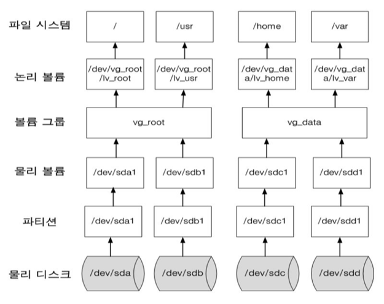
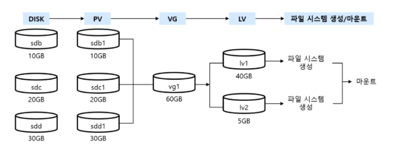
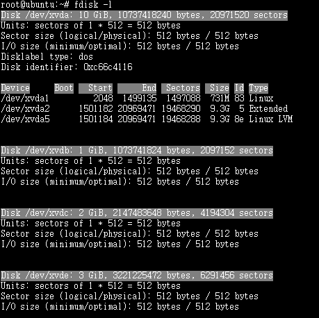

# Linux - 파일시스템, LVM(Logical Volume Manger)


1. ##### 파일시스템

- 운영체제가 파일을 시스템의 디스크상에 구성하는 방식

```
superblock
- 슈퍼블럭은 파일시스템 크기같은 전체적인 파일시스템에 대한 정보를 포함한다(여기에 들어가는 정보는 파일시스템에 의존한다)

inode
- 이름을 제외한 파일에 대한 모든 정보를 포함한다
- 파일이름은 inode 번호와 함께 디렉토리안에 저장된다

data block
- data block은 inode에 포함된다. inode는 몇개의 데이터 블록을 포함한다.
- 파일에서 데이터를 저장하기 위해 사용

directory block
- 파일 이름과 inode 번호를 저장하기 위해 사용

- indirection block
- 추가적인 데이터 블록을 위한 포인터들이 사용할 동적으로 할당되는 공간
```


2. ##### 리눅스 전용 디스크 기반 파일 시스템(EXT)

| 파일 시스템 | 설명                                                     |
| ----------- | -------------------------------------------------------- |
| EXT         | 리눅스 초기 파일 시스템, 호환성 없음                     |
|             | 2GB의 데이터와 파일명 255자까지 지정 가능                |
| EXT2        | 고용양 디스크 사용을 염두하고 설계된 파일 시스템         |
|             | 4TB 파일 크기까지 지원                                   |
| EXT3        | 리눅스의 대표적인 저널링을 지원하도록 확장된 파일 시스템 |
|             | ACL을 통한 접근 제어 지원, 16TB의 파일 크키까지 지원     |
| EXT4        | 파일에 디스크 할당시 물리적으로 연속적인 블록을 할당     |
|             | 64비트 기억 공간 제한을 없앰                             |
|             | 16TB 파일 크기까지 지원                                  |

3. ##### 저널링 파일 시스템(JFS, XFS, ReiserFS)

| 파일 시스템 | 설명                                                         |
| ----------- | ------------------------------------------------------------ |
| JFS         | IBM사의 독자적인 저널링 파일 시스템                          |
|             | GPL로 공개하여 현재 리눅스용으로 개발                        |
| XFS         | 고성능 저널링 시스템                                         |
|             | 64bit 주소 지원 및 확장성 있는 자료 구조와 알고리즘 사용     |
|             | 데이터 읽기/쓰기 트랜잭션으로 성능 저하를 최소화             |
| ReiserFS    | 독일의 한스 라이저가 개발한 파일 시스템                      |
|             | 모든 파일 객체들을 B트리에 저장, 간결한 색인화된 디렉터리 지원 |


4. ##### 네트워크 파일 시스템

| 파일 시스템 | 설명                                                         |
| ----------- | ------------------------------------------------------------ |
| SMB         | Server Message Block                                         |
|             | 삼바 파일 시스템을 마운트로 지정                             |
|             | 윈도우 계열 OS 환경에서 사용되는 파일/프린터 공유 프로토콜   |
| CIFS        | Common Internet File System                                  |
|             | SMB를 확장한 파일 시스템                                     |
|             | SMB를 기초로 응용하여 라우터를 뛰어넘어 연결할 수 있는 프로토콜 |
| NFS         | 동일 OS간 RPC를 기반으로 파일 공유시 사용 권장               |
|             | NFS 서버의 특정 디렉터리를 마운트하여 사용 가능              |
| EXT4        | 파일에 디스크 할당시 물리적으로 연속적인 블록을 할당         |


5. ##### 기타 파일 시스템

| 파일 시스템 | 설명                                                         |
| ----------- | ------------------------------------------------------------ |
| FAT         | Window NT가 지원하는 파일 시스템 중 가장 간단한 시스템       |
|             | FAT로 포맷된 디스크는 클러스터 단위로 할당하여, 클러스터 크기는 볼륨 크기에 따라 결정 |
| VFAT        | FAT 파일 시스템이 확장된 것으로 FAT보다 제한이 적음          |
|             | 공백이나 여러 개의 구두점도 포함                             |
| FAT32       | SMB를 확장한 파일 시스템, 다중 부팅 가능                     |
|             | 파일 크기 최대 4GB, 파티션 크기 최대 32GB                    |
| NTFS        | 윈도우에서 사용하는 파일 시스템                              |
|             | 안정성이 뛰어나고 대용량 파일도 저장                         |
| ISO 9660    | CD-ROM의 표준 파일 시스템                                    |
| UDF         | Universal Disk Format의 약자로 최신 파일 시스템 형식         |
|             | 광학 매체용 파일 시스템 표준                                 |
| HPFS        | OS/2 운영체제를 위해 만들어진 파일 시스템                    |


#### LVM(Logical Volume Manager)이란?

```
- 여러 개의 HDD의 용량을 합쳐서 하나의 파일 시스템을 구성하는 것
- 서버 운영에 있어서 작은 용량의 HDD를 하나로 합쳐 대용량의 스토리지를 구성할 때 사용
- 스토리지 확장 및 변경사항에 있어 유연한 대처가 가능
```


#### LVM에서 사용하는 용어

- Physical Volume : 물리적인 볼륨을 말하며, /dev/sdb1, /dev/sdc1과 같은 실제 파티션
- Volume Group : Physical Volume을 합친 그룹
- Logical Volume: 합쳐진 Volume Group을 나누어 실제 사용하는 불륨




### LVM 구성하기



- 1G, 2G, 3G 디스크 추가




#### 구성 방식

- 1G, 2G 두개 디스크를 사용하여 512M, 1G, 1.5G 디스크 볼륨 생성


#### 파티션 생성

```shell
xvdb, xvdc 두번 진행

fisk /dev/xvdb1
n -> p -> 1 -> enter -> enter
t -> 8e -> w

# fdisk /dev/xvdb1
Welcome to fdisk (util-linux 2.34).
Changes will remain in memory only, until you decide to write them.
Be careful before using the write command.
Device does not contain a recognized partition table.
Created a new DOS disklabel with disk identifier 0xa066b799.
Command (m for help): n
Partition type
   p   primary (0 primary, 0 extended, 4 free)
   e   extended (container for logical partitions)
Select (default p): p
Partition number (1-4, default 1): 1
First sector (2048-209715199, default 2048):
Last sector, +/-sectors or +/-size{K,M,G,T,P} (2048-209715199, default 209715199):
Created a new partition 1 of type 'Linux' and of size 100 GiB.
Command (m for help): t
Selected partition 1
Hex code (type L to list all codes): 8e
Changed type of partition 'Linux' to 'Linux LVM'.
Command (m for help): w
The partition table has been altered.
Calling ioctl() to re-read partition table.
Syncing disks.
```


#### 물리적 볼륨 생성

- /dev/xvdb1과 /dev/xvdc1로 물리적 볼륨을 생성한다

```shell
root@ubuntu:~# pvcreate /dev/xvdb1
  Physical volume "/dev/xvdb1" successfully created
root@ubuntu:~# pvcreate /dev/xvdc1
  Physical volume "/dev/xvdc1" successfully created
```


#### 볼륨 그룹 만들기

- /dev/xvdb1 과 /dev/xvdc1를 볼륨 그룹으로 만든다
- 볼륨 그룹명(VG-01) - 다른 이름 사용가능

```shell
root@ubuntu:~# vgcreate VG-01 /dev/xvdb1 /dev/xvdc1
  Volume group "VG-01" successfully created
```


#### 논리적 볼륨 만들기

- 볼륨 그룹에 512M, 1G 1.5G 크기의 논리적 볼륨(Logical Volume) 생성
- LG-01,02,03은 논리적볼륨 이름으로 다른 이름 사용 가능

```shell
root@ubuntu:~# lvcreate --size 512M --name LG-01 VG-01
  Logical volume "LG-01" created.
root@ubuntu:~# lvcreate --size 1G --name LG-02 VG-01     
  Logical volume "LG-02" created.
root@ubuntu:~# lvcreate --extents 100%FREE --name LG-03 VG-01
  Logical volume "LG-03" created.
```


#### 포맷하고 마운트 하기

- ##### 논리적 볼륨 포맷

```shell
root@ubuntu:~# mkfs.ext4 /dev/VG-01/LG-01 
mke2fs 1.42.13 (17-May-2015)
Creating filesystem with 131072 4k blocks and 32768 inodes
Filesystem UUID: 8603529a-20f4-4562-b114-2d17ae15462f
Superblock backups stored on blocks: 
        32768, 98304

Allocating group tables: done                            
Writing inode tables: done                            
Creating journal (4096 blocks): done
Writing superblocks and filesystem accounting information: done
```

- ##### 마운트

```SHELL
root@ubuntu:~# mount /dev/VG-01/LG-01 /data1
root@ubuntu:~# df -h
Filesystem                   Size  Used Avail Use% Mounted on
udev                         2.0G     0  2.0G   0% /dev
tmpfs                        395M  5.7M  389M   2% /run
/dev/mapper/ubuntu--vg-root  8.1G  5.5G  2.2G  72% /
tmpfs                        2.0G     0  2.0G   0% /dev/shm
tmpfs                        5.0M     0  5.0M   0% /run/lock
tmpfs                        2.0G     0  2.0G   0% /sys/fs/cgroup
/dev/xvda1                   720M   59M  625M   9% /boot
tmpfs                        395M     0  395M   0% /run/user/1000
tmpfs                        395M     0  395M   0% /run/user/114
/dev/mapper/VG--01-LG--01    488M  396K  452M   1% /data1
```

- ##### LG-02, LG-03 동일 진행

```SHELL
root@ubuntu:~# df -h
Filesystem                   Size  Used Avail Use% Mounted on
udev                         2.0G     0  2.0G   0% /dev
tmpfs                        395M  5.7M  389M   2% /run
/dev/mapper/ubuntu--vg-root  8.1G  5.5G  2.2G  72% /
tmpfs                        2.0G     0  2.0G   0% /dev/shm
tmpfs                        5.0M     0  5.0M   0% /run/lock
tmpfs                        2.0G     0  2.0G   0% /sys/fs/cgroup
/dev/xvda1                   720M   59M  625M   9% /boot
tmpfs                        395M     0  395M   0% /run/user/1000
tmpfs                        395M     0  395M   0% /run/user/114
/dev/mapper/VG--01-LG--01    488M  396K  452M   1% /data1
/dev/mapper/VG--01-LG--02    976M  1.3M  908M   1% /data2
/dev/mapper/VG--01-LG--03    1.5G  2.3M  1.4G   1% /data3
```


### LVM 수정하기

- ##### 파티션생성 -> 물리적 볼륨 생성

```SHELL
root@ubuntu:~# fdisk /dev/xvde

root@ubuntu:~# pvcreate /dev/xvde1
  Physical volume "/dev/xvde1" successfully created
```


- ##### VG-01 볼륨 그룹에 추가

```SHELL
root@ubuntu:~# vgextend VG-01 /dev/xvde1
  Volume group "VG-01" successfully extended
  
root@ubuntu:~# pvs
  PV         VG        Fmt  Attr PSize    PFree
  /dev/xvda5 ubuntu-vg lvm2 a--     9.28g    0 
  /dev/xvdb1 VG-01     lvm2 a--  1020.00m    0 
  /dev/xvdc1 VG-01     lvm2 a--     2.00g    0 
  /dev/xvde1 VG-01     lvm2 a--     3.00g 3.00g
```


#### 논리적 볼륨 확장하기

- /dev/VG-01/LG-01의 크기를 800MB로 늘리기

```shell
root@ubuntu:~# lvextend -L800M /dev/VG-01/LG-01 
  Size of logical volume VG-01/LG-01 changed from 512.00 MiB (128 extents) to 800.00 MiB (200 extents).
  Logical volume LG-01 successfully resized.  
```

- 파일 시스템 크기 확장

```
root@ubuntu:~# resize2fs /dev/VG-01/LG-01 
resize2fs 1.42.13 (17-May-2015)
Filesystem at /dev/VG-01/LG-01 is mounted on /data1; on-line resizing required
old_desc_blocks = 1, new_desc_blocks = 1
The filesystem on /dev/VG-01/LG-01 is now 204800 (4k) blocks long.

root@ubuntu:~# df -h
Filesystem                   Size  Used Avail Use% Mounted on
udev                         2.0G     0  2.0G   0% /dev
tmpfs                        395M   11M  384M   3% /run
/dev/mapper/ubuntu--vg-root  8.1G  5.5G  2.2G  72% /
tmpfs                        2.0G     0  2.0G   0% /dev/shm
tmpfs                        5.0M     0  5.0M   0% /run/lock
tmpfs                        2.0G     0  2.0G   0% /sys/fs/cgroup
/dev/xvda1                   720M   59M  625M   9% /boot
tmpfs                        395M     0  395M   0% /run/user/1000
tmpfs                        395M     0  395M   0% /run/user/114
/dev/mapper/VG--01-LG--01    770M  520K  723M   1% /data1
/dev/mapper/VG--01-LG--02    976M  1.3M  908M   1% /data2
/dev/mapper/VG--01-LG--03    1.5G  2.3M  1.4G   1% /data3
```


#### LVM 삭제하기

- umount 진행

- ##### 논리적 볼륨 삭제

```SHELL
root@ubuntu:~# umount /data3
root@ubuntu:~# lvremove /dev/VG-01/LG-03
  Logical volume VG-01/LG-03 contains a filesystem in use.
```


##### 볼륨 그룹 삭제

- 볼륨그룹 안에 논리적 볼륨이 남아 있으면 삭제 할 것인지 확인한다.

```
root@ubuntu:~# vgremove VG-01 
Do you really want to remove volume group "VG-01" containing 1 logical volumes? [y/n]: y
Do you really want to remove and DISCARD active logical volume LG-01? [y/n]: y
  Logical volume "LG-01" successfully removed
  Volume group "VG-01" successfully removed
```


##### 물리적 볼륨 삭제하기

```
root@ubuntu:~# pvremove /dev/xvdc1
  Labels on physical volume "/dev/xvdc1" successfully wiped
root@ubuntu:~# pvremove /dev/xvdb1
  Labels on physical volume "/dev/xvdb1" successfully wiped
root@ubuntu:~# pvremove /dev/xvde1
  Labels on physical volume "/dev/xvde1" successfully wiped
```


##### PV 확인

```SHELL
root@ubuntu:~# pvs
  PV         VG        Fmt  Attr PSize    PFree
  /dev/xvda5 ubuntu-vg lvm2 a--     9.28g    0 
  /dev/xvdb1 VG-01     lvm2 a--  1020.00m    0 
  /dev/xvdc1 VG-01     lvm2 a--     2.00g    0 
```


##### VG 확인

```SHELL
root@ubuntu:~# vgs
  VG        #PV #LV #SN Attr   VSize VFree
  VG-01       2   3   0 wz--n- 2.99g    0 
  ubuntu-vg   1   2   0 wz--n- 9.28g    0 
```


##### LV 확인

```
root@ubuntu:~# lvs
  LV     VG        Attr       LSize   Pool Origin Data%  Meta%  Move Log Cpy%Sync Convert
  LG-01  VG-01     -wi-ao---- 512.00m                                                    
  LG-02  VG-01     -wi-ao----   1.00g                                                    
  LG-03  VG-01     -wi-ao----   1.49g                                                    
  root   ubuntu-vg -wi-ao----   8.32g                                                    
  swap_1 ubuntu-vg -wi-ao---- 980.00m   
```


##### VG 상태 확인

```SHELL
root@ubuntu:~# vgdisplay VG-01
  --- Volume group ---
  VG Name               VG-01
  System ID             
  Format                lvm2
  Metadata Areas        3
  Metadata Sequence No  5
  VG Access             read/write
  VG Status             resizable
  MAX LV                0
  Cur LV                3
  Open LV               3
  Max PV                0
  Cur PV                3
  Act PV                3
  VG Size               5.99 GiB
  PE Size               4.00 MiB
  Total PE              1533
  Alloc PE / Size       766 / 2.99 GiB
  Free  PE / Size       767 / 3.00 GiB
  VG UUID               ofXZ7U-dmia-cI6L-Tzo9-6DRB-MyAJ-BNuAnH
```


